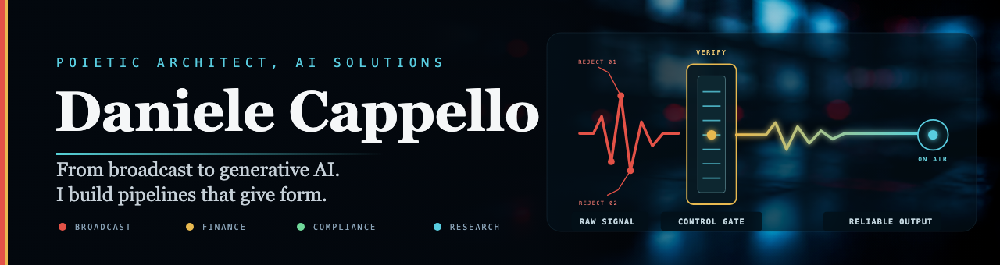

  

Ho lavorato per vent'anni nel broadcast televisivo, di cui quattordici alla guida di un team tecnico di 30 persone nelle regie di Sky Sport 24 e Sky TG24. Dal 2023 applico la stessa disciplina, fondata su operatività in tempo reale, affidabilità e responsabilità, alla costruzione di sistemi AI end-to-end.

## Riscontri pubblici

- [Geometry Sets the Budget](https://doi.org/10.5281/zenodo.21442383): ricerca pubblicata con DOI, codice e dati.
- [Sylvester-Gallai in FormalBook](https://github.com/mo271/FormalBook/pull/140): formalizzazione approvata e integrata.
- [Erdős 1064, k=2](https://github.com/google-deepmind/formal-conjectures/pull/4633) e [Green 40, f_tilde_le_f](https://github.com/google-deepmind/formal-conjectures/pull/4419): contributi accettati in `formal-conjectures` di Google DeepMind.
- [Politopi regolari](https://github.com/Solarys431/lean-eval-platonic-classification): classificazione presente nella leaderboard `lean-eval`.

## Altri collegamenti

[Hugging Face](https://huggingface.co/Dax451) · [DAEDALUS](https://daedalustrade.com) · [Museo](https://museumofsyntheticvoices.com)

[Read in English](README.md)
